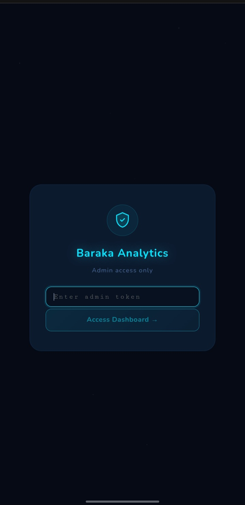

🌙 Al-Madih: Full-Stack Telegram Mini-App & Audio Platform

## 📌 Overview
**Al-Madih** is a production-ready, high-performance audio streaming platform built natively into Telegram using the Telegram Web App (Mini App) ecosystem. It serves hundreds of active users, providing a seamless, mobile-native experience to discover, stream, and manage a catalog of over 1,150 audio tracks.

The project bridges a Python-based Telegram Bot backend with a modern Next.js frontend, featuring advanced system optimizations, secure admin analytics, and a frictionless user experience.

## 🚀 Key Features
* **Telegram Mini-App Integration:** A fluid, app-like UI inside Telegram with slide transitions and pull-to-refresh mechanics.
* **Infinite Scroll & Pagination:** Effortlessly browse a massive audio catalog without performance degradation, utilizing cursor-based MongoDB pagination.
* **Fuzzy Search:** Smart search capabilities to find tracks even with minor spelling variations.
* **Custom Playlists & Favorites:** Users can build personalized collections and share them instantly via Telegram deep links.
* **Force-Join Gating:** Automated Telegram channel subscription verification before allowing app access.
* **Broadcast System:** Admin tools to seamlessly broadcast messages to the entire user base.

## 🧠 Technical Highlights & Engineering Decisions

As a Software Engineer, I focused heavily on scalability, security, and resource optimization:

### 1. Zero-Bandwidth Image Proxy (CDN Optimization)
Telegram file URLs expire dynamically. Fetching and serving 1,000+ cover images directly through a serverless function would exhaust Vercel's bandwidth limits. 
* **The Solution:** I engineered a lightweight API proxy (`/api/webapp/thumb`) that fetches the temporary Telegram CDN URL and issues an **HTTP 302 Redirect**. The client's browser downloads the image directly from Telegram's servers, resulting in **zero bandwidth cost** on my infrastructure.
* **Graceful Fallback:** If a track lacks a thumbnail, the UI seamlessly falls back to a deterministic, beautifully generated 8-palette gradient based on the track's name, ensuring a premium look with zero network requests.

### 2. Secure "Baraka Analytics" Admin Dashboard
Built a comprehensive analytics dashboard to track total users, catalog size, user growth, and trending audio tracks.
* **Security:** Implemented highly secure authentication using Node's `crypto.timingSafeEqual`. This mitigates timing attacks by comparing the hashed input token against the environment variable in constant time.

### 3. Crash-Proof Data Extraction
* Engineered the Python bot handlers to safely parse incoming Telegram messages. Used chained `.get()` methods and strict `try/except` blocks to extract `thumb_file_id` seamlessly, ensuring the production bot never crashes even if Telegram's API response structure changes.

## 🛠️ Tech Stack
* **Frontend:** Next.js, React, Tailwind CSS (Mobile-first, Premium UI/UX)
* **Backend API:** Vercel Serverless Functions (Node.js)
* **Bot Backend:** Python (Motor Asyncio, aiohttp)
* **Database:** MongoDB Atlas (NoSQL)

## 📸 Screenshots
* ​
* ​
* ​

## 📬 Let's Connect
I am a passionate Software Engineer focused on building practical, scalable, and user-centric applications. Open to Software Engineering roles and collaborations!

* **Telegram:** https://t.me/YourAdminUser
